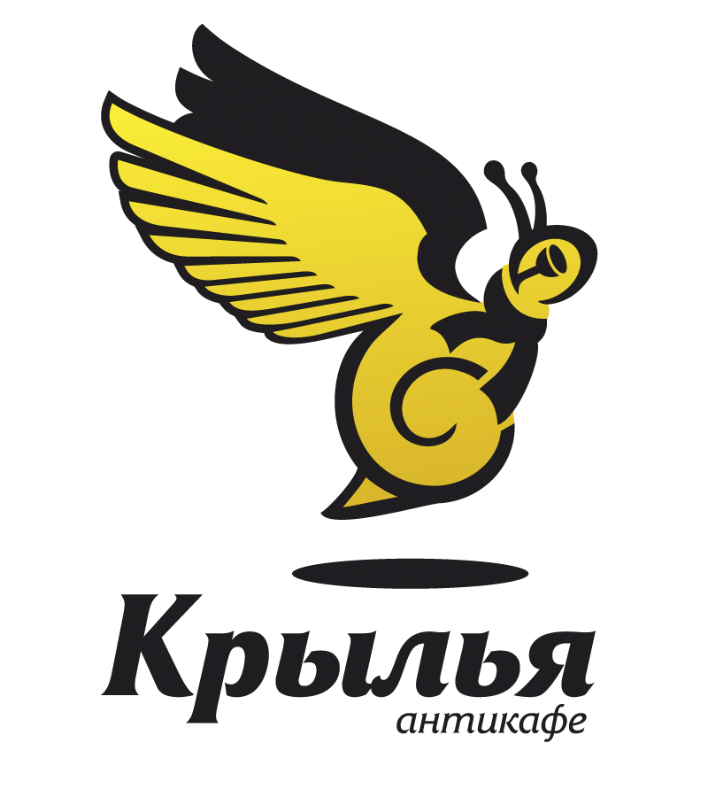
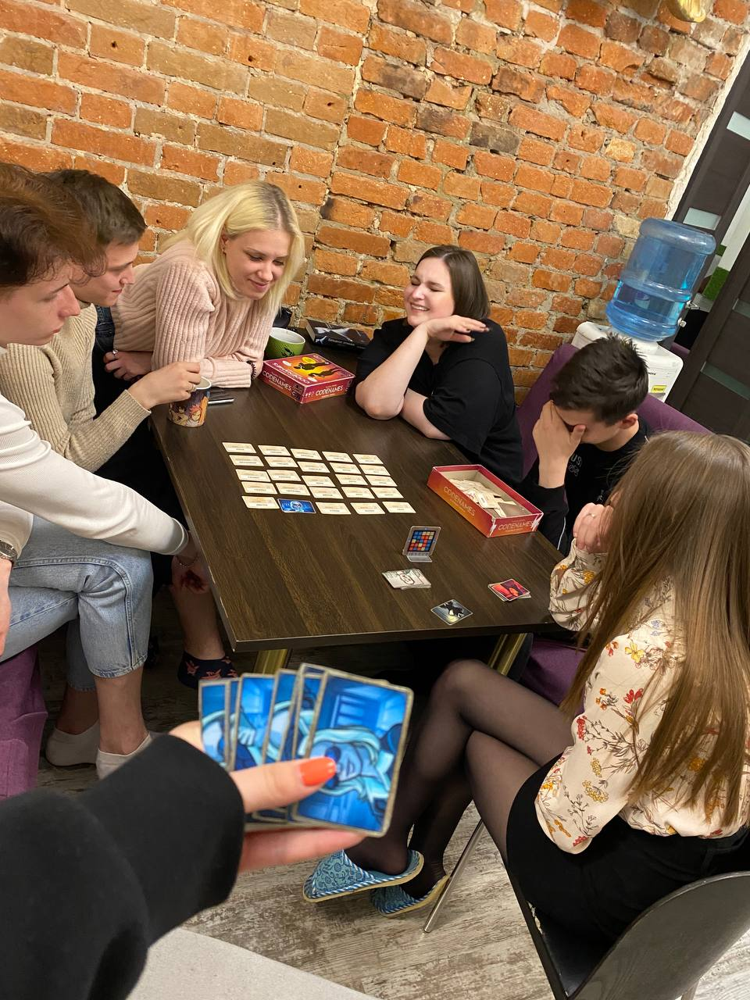
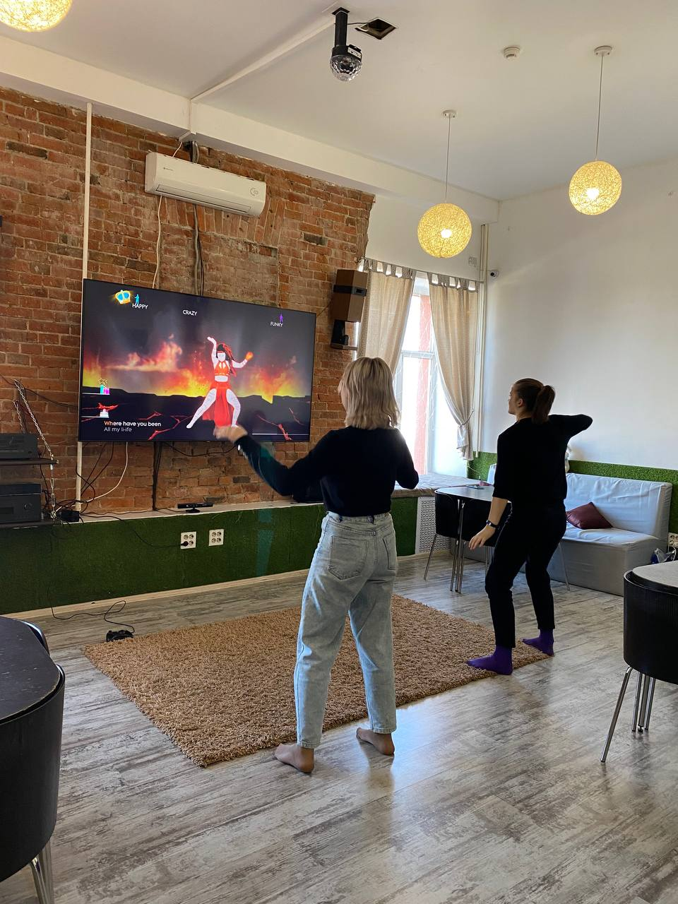
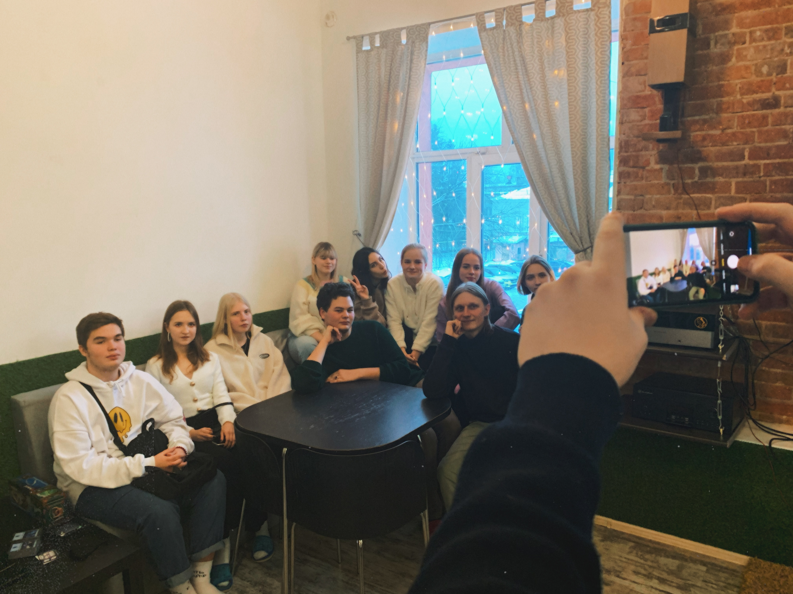
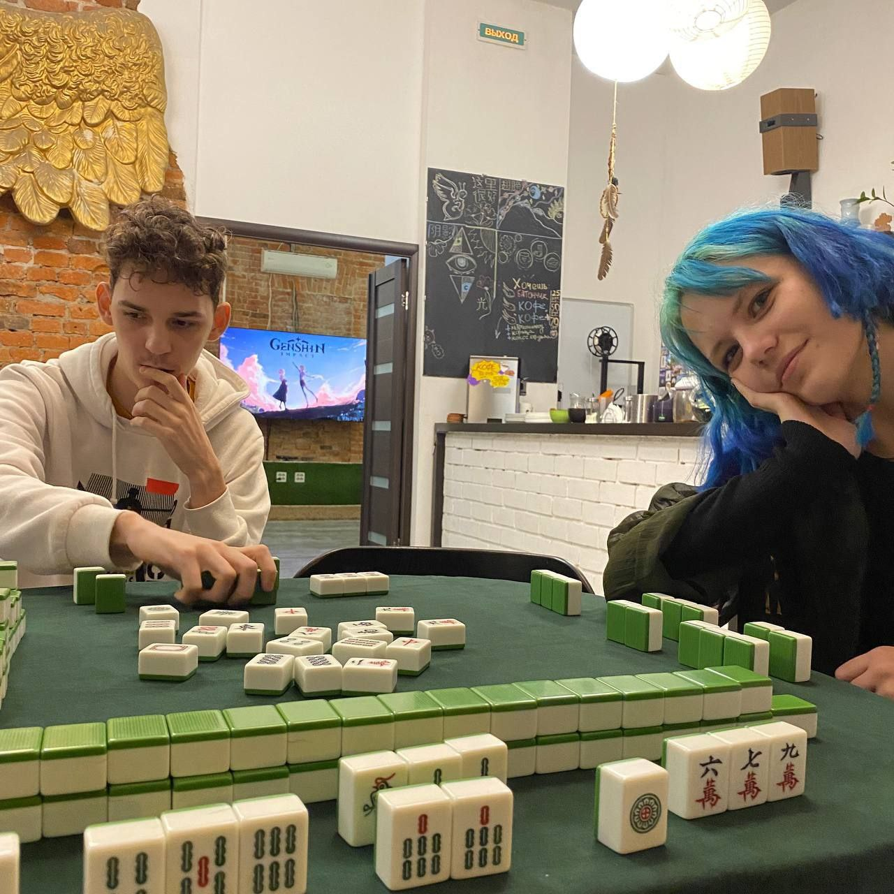
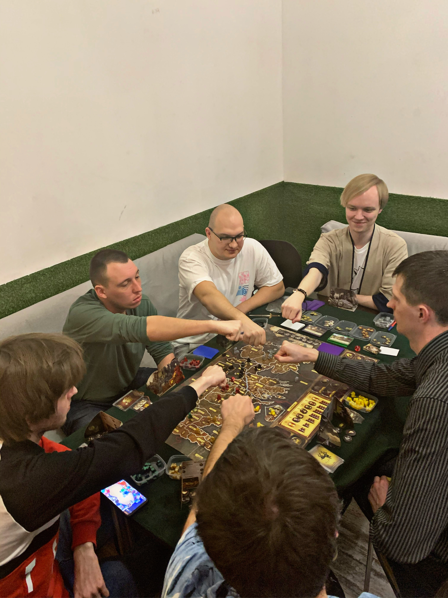
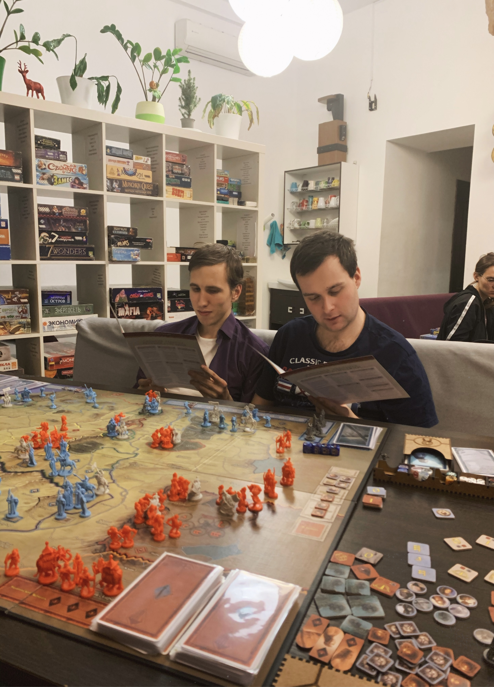
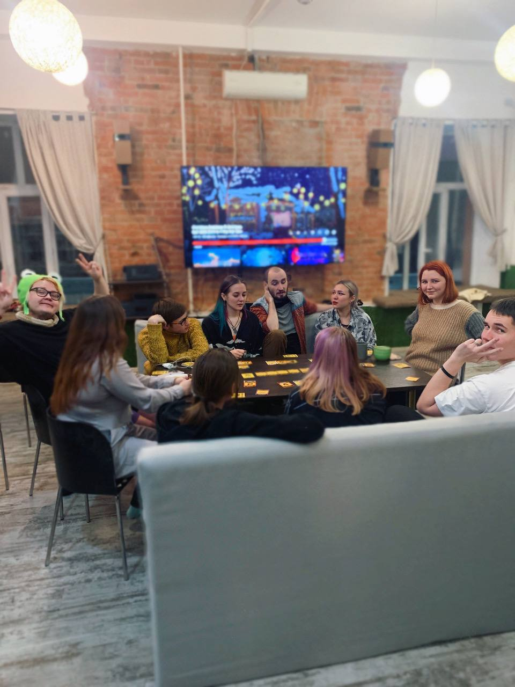

#     _Антикафе "Крылья"_
#### _Доброго времени суток. Меня зовут Давид. Я бы хотел рассказать больше всего не про себя а про то чем я сейчас занимаюсь._
#### _Я работаю управляющим в антикафе "Крылья". Скорей всего вам будет непонятно слово антикафе. Это заведение, в котором вместо еды и напитков, как в обычном кафе или ресторане, вам предлагают уют и комфорт. "Крылья" существуют уже почти 10 лет. Однако прибыльным это место не становится, потому что такой род деятельности слабо приживается в небольших городах. Живу я в Пензе. И вроде неплохой городок, но не всё тут и хорошо..._
#### _Мне очень хочется, начать зарабатывать самому и помогать своему заведению. В будущем я хочу сделать хороший сайт для "Крыльев"  и начать усовершенствовать технически и финаносвого хорошее заведение. Для меня "Крылья" это место для души, где мы своей командой стараемся передать дух доброты и уюта, что бы всем, кто приходит к нам было легче =) Данное задание я хочу посветить рассказы и знакомству Вас с этим прекрасным местом._  

## Антикафе Крылья - душевное место в центре города, в которое вы всегда можете зайти, как к себе домой или в гости к хорошим друзьям) У нас уютно до кончиков пальцев и разуваются на входе ☺️
#### У нас можно:
- знакомиться с хорошими новостями людьми
- заниматься творчеством
- посещать интересные мероприятия
- уютно читать книги
- посидеть в интернете(Free Wi-fi)
- пить сколько кофе и чая
есть печеньки(в таком же количестве).
- Можно приносить свою еду с собой (У нас есть холодильник, тарелочки, вилочки и все такое)
- Играть в настольные игры или X-box, Playstation.
- Делать что угодно, если это нравится вам и не смущает других).

## Крылья - место которое арендует и использует по своему усмотрению каждый пришедший. И развиваемся и становимся интересными мы как раз благодаря своим гостям.

Внутри почти всё бесплатно - оплата только за время своего пребывания.

|  |  |  |  |
| ------------ | ---------- | -------------| -------- |

В антикафе "Крылья" происходит много всего. Некоторым гостям даже кажется, что выбор дел может быть бесконечным =)
## Мы стараемся разнообразить жизнь заведения и для наших гостей мы проводим разные игротеки настольные, мероприятия разного характера, а также всегда готовы поддержить хорошие инициативные идеи в стенах нашего антикафе.  

| || |
|-------|------|-------|
# Ждём Вас в гости! 
## Наши контакты
- [Группа в VK](https://vk.com/anticafe_krilya)
- [Наш Телеграм Канал](https://t.me/anticafe_krilya)
- #### +7 (927) 289-28-63  - И это наш телефон =)
- _А вот тут был бы наш сайт, где были все подробности и хорошие вещи для развития_ 😇❤
